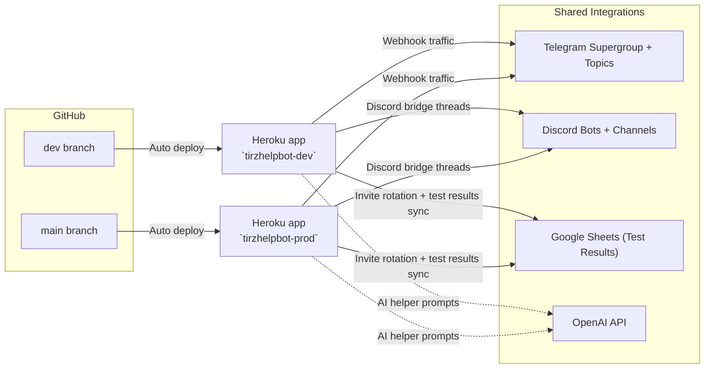

# 🤖 TirzHelpBot
*Telegram + Discord automation for the Stairway to Gray community*

TirzHelpBot is a Flask-based worker that:

- Automates moderation and helper flows inside Telegram supergroups
- Bridges test results between Discord and Telegram (bi-directional)
- Keeps a Discord root channel stocked with fresh Telegram invite links
- Extracts lab/test results and syncs them to Google Sheets

This README doubles as the onboarding guide **and** the day-to-day runbook so anyone on the mod team can spin up, deploy, or troubleshoot the bot.

---

## Feature Highlights

- **Telegram automation** – `/newbie`, `/lastcall`, `/safety`, auto-welcome, topic moderation, YAML-driven banned topics/responses
- **Discord ↔ Telegram bridge** – Links & images from Discord → Telegram topic and Telegram images → Discord channel
- **Telegram invite rotation** – Generates & revokes batches of invites and keeps the Discord root channel updated
- **Test result ingestion** – Pulls PDFs/images from the Telegram test-results topic and pipes gpt-4.1-mini parsed data into Google Sheets

---

## Architecture at a Glance

| Component | Description |
| --- | --- |
| `bot.py` | Flask app entry point + webhook handling |
| `src/helpers_*.py` | Domain-specific helpers (Telegram, Discord, invites, OpenAI, Google, etc.) |
| `mod_topics/*.yml` | Moderation configuration for banned topics / auto responses |
| Heroku Apps | `tirzhelpbot-dev` (dev) and `tirzhelpbot-prod` (prod) |

### Deployment topology



**Notes**

- Both apps share the same codebase but use different config vars (Telegram token, Discord tokens, Google creds, etc.).
- The Procfile defines a `web` dyno that runs `gunicorn` to serve the Flask webhook plus background threads (invite rotation, Discord bridge, periodic announcements).
- Heroku release phase runs `python bot.py --delete-webhook`, `--set-webhook`, and `--check-webhook` so Telegram always points to the latest deployment.
- `dev` runs against the Testbed Telegram/Discord workspace, while `prod` serves the live Stairway to Gray community.

---

## Getting Started

### Prerequisites

**Mod Team**
- Access to the GitHub repo (collaborator) if on Mod team
- Heroku collaborator access to `tirzhelpbot-dev` and `tirzhelpbot-prod`
- Telegram access to the dev and prod supergroups
- Optional: Discord admin rights for the Stairway to Gray server if working on the bridge bot

(for access: TG @seeker-seventy-six or @true_case)

*Public Community**
- Fork the repo and open pull-request with code updates

### Clone & Environment Setup

```bash
git clone https://github.com/seeker-seventy-six/tirzhelp-bot.git
cd tirzhelp-bot

# install local environment for developmment
conda env create -f local_environment.yml
conda activate tirzbot
```

### Environment Variables

Create `.env-dev` (and `.env-main` if you run prod locally). Values for the shared bots live in Heroku → *Settings → Config Vars*. Use `.env-template` for reference. These local .env files are just for local development. Deployments run off heroku env vars.

| Key | Notes |
| --- | --- |
| `BOT_TOKEN` | Telegram bot token (dev or prod) |
| `WEBHOOK_URL` | e.g. `https://tirzhelpbot-dev.herokuapp.com/webhook` |
| `ENVIRONMENT` | `DEV` or `PROD` (affects logging + safeguards) |
| `OPENAI_TOKEN` | For AI-powered helper responses |
| `GOOGLE_SERVICE_ACCOUNT_FILE` | Path to JSON creds for Sheets upload |
| `DISCORD_BOT_TOKEN` | Discord bridge bot token |
| `DISCORD_STGTS_CHANNEL_ID` | Discord channel that mirrors Telegram test results |
| `DISCORD_ROOT_CHANNEL_ID` | Discord channel where rotating invites post |


## Discord ↔ Telegram Bridge & Invite Rotation

This functionality lives primarily in `src/helpers_discord.py` and runs alongside the Telegram bot workers.

### Channels & Topics

- **Discord STGTS Channel** – `#public-test-results-no-discussion`
- **Telegram Topic** – `Test Results 3P ONLY - No Discussion`
- **Discord STG Root Channel** – defined via `DISCORD_ROOT_CHANNEL_ID` for invite posts in the landing STG discord

### 1. Create the Discord Bot

1. Visit https://discord.com/developers/applications → *New Application*
2. Under **Bot**, click **Add Bot**
3. Copy the token → add to `.env-*`
4. Enable **Message Content Intent**

### 2. Add the Bot to the Servers

1. Navigate to **OAuth2 → URL Generator**
2. Scopes: `bot`
3. Permissions: `View Channels`, `Read Messages`, `Read Message History`, `Send Messages`, `Attach Files`
4. Use the generated link to invite the bot to the STGTS Discord server and to the STG Discord server

### 3. Required Environment Variables

```env
DISCORD_BOT_TOKEN=...
DISCORD_STGTS_CHANNEL_ID=...
DISCORD_ROOT_CHANNEL_ID=...
```

### 4. Deploy / Redeploy

Once these vars exist in Heroku (both dev + prod), redeploy the app. The background threads automatically:

- Mirror Discord links/images → Telegram topic
- Mirror Telegram images → Discord channel
- Rotate Telegram invite batches and keep the Discord root message fresh

### File Structure Reference

```
src/
├── helpers_discord.py    # Bridge + invite rotation
├── helpers_telegram.py   # Telegram utilities
└── ...
```

---

## Local Development Workflow

1. Create Feature Branch from `dev` (e.g. `ft-new-mod-rules`)
2. Update / add tests if needed (`tests/integration/...`)
3. Run targeted scripts locally as needed (e.g., `python download_test_data_channel.py`)
4. Push to GitHub → open PR → merge into `dev` when approved

Merging into `dev` deploys automatically to the Heroku dev app testable in the Testbed TG group, so you can live-test there before promoting to `main`.

---

## Deployment & Release Flow

### CI/CD (GitHub → Heroku)

| Branch | Auto-deploy target |
| --- | --- |
| `dev` | `tirzhelpbot-dev` |
| `main` | `tirzhelpbot-prod` |

- GitHub → Settings → Branch protection ensures PRs are reviewed before landing in `main`
- Heroku auto deploys the latest successful commit on each branch within ~2 minutes

### Webhook Management

After any fresh Heroku app setup or URL change:

```bash
heroku run python bot.py setwebhook --app tirzhelpbot-dev
heroku run python bot.py setwebhook --app tirzhelpbot-prod
```

Confirm with:

```bash
curl https://api.telegram.org/bot<token>/getWebhookInfo
```

---

## Operations Runbook

### Check Heroku Dynos

```bash
heroku ps --app tirzhelpbot-prod
heroku ps --app tirzhelpbot-dev
```

Expect at least one `web` dyno running. Restart if needed:

```bash
heroku restart --app tirzhelpbot-prod
```

### Tail Logs / Debug Issues

```bash
heroku logs --tail --app tirzhelpbot-dev
heroku logs --tail --app tirzhelpbot-prod
```

Helpful filters:

```bash
heroku logs --tail --app tirzhelpbot-prod | grep Discord
heroku logs --tail --app tirzhelpbot-prod | grep Invite
```

### Redeploy / Roll Forward

1. Merge the fix to the appropriate branch (`dev` for staging validation, `main` for production)
2. Heroku auto deploys
3. Watch logs to confirm the Flask worker boots and the Discord bridge thread announces readiness

To rollback:

```bash
heroku releases --app tirzhelpbot-prod
heroku releases:rollback v123 --app tirzhelpbot-prod
```

### Common Issues

- **Missing or wrong env vars** – double-check `.env-*` locally or Heroku Config Vars
- **Webhook 403/404** – rerun `setwebhook` after confirming `WEBHOOK_URL`
- **Discord bridge silent** – ensure the Discord bot still has channel permissions & intents enabled
- **Google Sheets failures** – verify the service account still has access to the destination sheet

---

## Helpful Commands Cheat Sheet

| Action | Command |
| --- | --- |
| Login to Heroku | `heroku login` |
| Tail prod logs | `heroku logs --tail --app tirzhelpbot-prod` |
| Tail dev logs | `heroku logs --tail --app tirzhelpbot-dev` |
| Restart dynos | `heroku restart --app <app>` |

---

## Discord Server Backup Template

If the Discord server ever needs recreating, start from this template:

https://discord.new/EDzNm6Gzz9S3

---

Questions? Ping @seekerseventysix or @true_case in Telegram.
